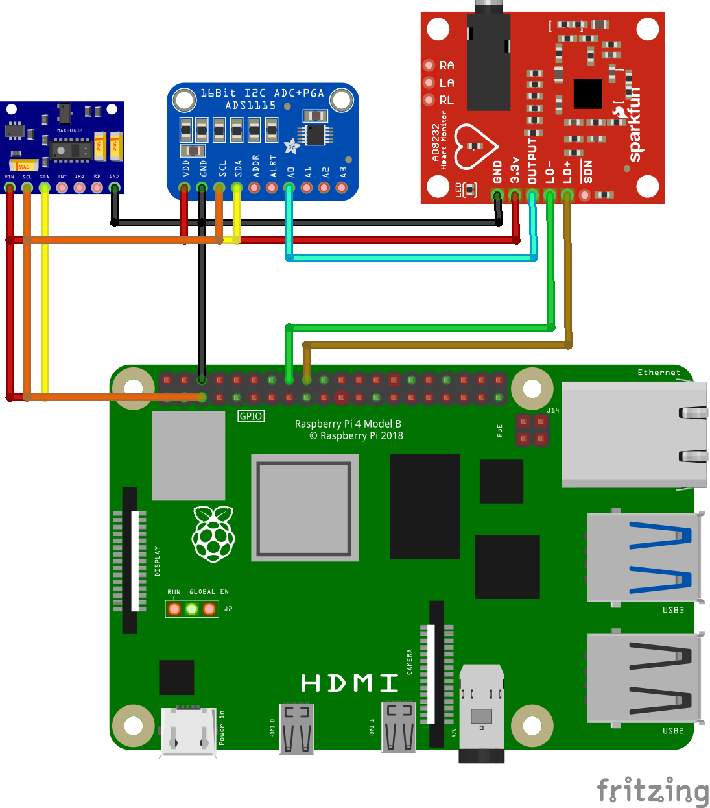

# Hardware Overview

This readme file provides an overview of the hardware components used in the HeartGuard project and their connections.

## Hardware Components

1. RaspberryPi: [Insert RaspberryPi name/model]
   - Description: [Provide a brief description of the RaspberryPi]
   - Connection: [Explain how the RaspberryPi is connected to other components]

2. Sensors: [Insert sensor names/models]
   - Description: [Provide a brief description of the sensors]
   - Connection: [Explain how the sensors are connected to the RaspberryPi]

3. Other Components: [Insert any other hardware components used]
   - Description: [Provide a brief description of the other components]
   - Connection: [Explain how these components are connected to the RaspberryPi]

## Hardware Connection Diagram

The above diagram illustrates the connections between the various hardware components used in the HeartGuard project.

## Connection

[Provide any instructions or guidelines for using the hardware components]
