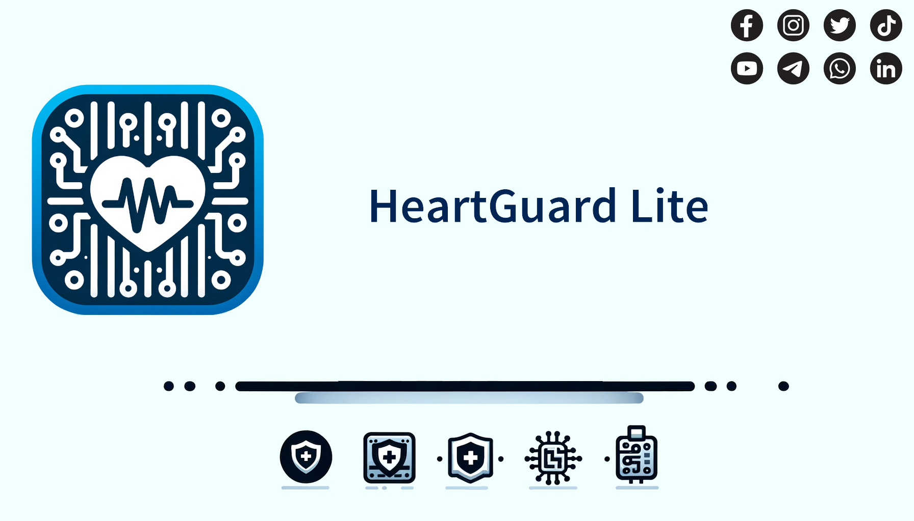

# HeartGuard Lite



## An affordable solution to Heart Diagnostics

Cardiovascular diseases are the leading cause of death globally, especially in low and middle-income countries. Current heart monitoring methods are limited by high costs and accessibility challenges.
The HealthGuard Lite aims to develop a cost-effective, accessible heart monitoring solution using Raspberry Pi.​

## Hardware

Requiring only a Raspberry Pi, Electrocardiogram (ECG) electrodes, a Heart Rate Monitor and an Analogue to Digital Converter (ADC). The HeartGuard Lite provides realtime diognostics on heart rate variability, aswell as warnings of potential long term health risks.

## Key Features

- Real Time Heart Rate Variability Measurement
- Responsive Health Risk Suggestions
- Sensor Fusion to get the most accurate results

## Requirements

- a modern C++17 compiler (`gcc-8`, `clang-6.0`, `MSVC 2017` or above)
- [`cmake`](https://cmake.org) 3.15+
- `libpigpio-dev`

### Installing Required Tools

Before running the HeartGuard Lite software, you need to install some tools on your Raspberry Pi. Here are the steps:

1. Update your Raspberry Pi:

```shell
sudo apt update
sudo apt upgrade
```

Install the C++ compiler and cmake:

```shell
sudo apt install build-essential cmake
```

Install the libpigpio-dev library:

```shell
sudo apt install libpigpio-dev
```

These commands will install the GCC C++ compiler, cmake, and the libpigpio-dev library, which are required to build and run the HeartGuard Lite software.

### Enabling I2C on Raspberry Pi

Before running the HeartGuard Lite software, you need to enable the I2C interface on the Raspberry Pi. Here are the steps:

1. Open the Raspberry Pi configuration tool from the terminal:

```shell
sudo raspi-config
```

2. Navigate to 5 Interfacing Options and press Enter.
3. Navigate to `P5 I2C` and press Enter.
4. When asked Would you like the ARM I2C interface to be enabled?, select <Yes> and press Enter.
5. You should see a message saying `The ARM I2C interface is enabled`. Press Enter to continue.
6. Finally, select `<Finish>` to exit the configuration tool.

#### Enabling I2C-0 on Raspberry Pi

The I2C-0 interface is typically used for HAT EEPROM, but it can be used for other purposes if you're not using a HAT that requires the EEPROM. Here are the steps to enable it:

1. Open the `/boot/config.txt` file in a text editor:

```shell
sudo nano /boot/config.txt
```

2. Add the following line to the end of the file:

```
dtparam=i2c_vc=on
```

3. Save the file and exit the text editor.

After enabling I2C, you should reboot your Raspberry Pi:

```shell
sudo reboot
```

After the Raspberry Pi reboots, you can check that the I2C interface has been enabled by running:

```shell
ls /dev/*i2c*
```

You should see /dev/i2c-1 and /dev/i2c-0 in the output, which indicates that the I2C interface is enabled.

## Available CMake Options

- BUILD_SHARED_LIBS - enables or disables the generation of shared libraries

## How to build from command line

The project can be built using the following commands:

```shell
cd HeartGuard/Software/Firmware/
mkdir -p build # md build (on Windows)
cd build
cmake -DBUILD_SHARED_LIBS=FALSE -DCMAKE_BUILD_TYPE=Release ..
cmake --build .
cmake --build . --target package
```

## Acknowledgements

This project uses the [modern C++ project template](https://github.com/madduci/moderncpp-project-template) by [madduci](https://github.com/madduci).

This project also uses code from the [rpi_ads1115](https://github.com/berndporr/rpi_ads1115/tree/main?tab=readme-ov-file) repository by [berndporr](https://github.com/berndporr).
